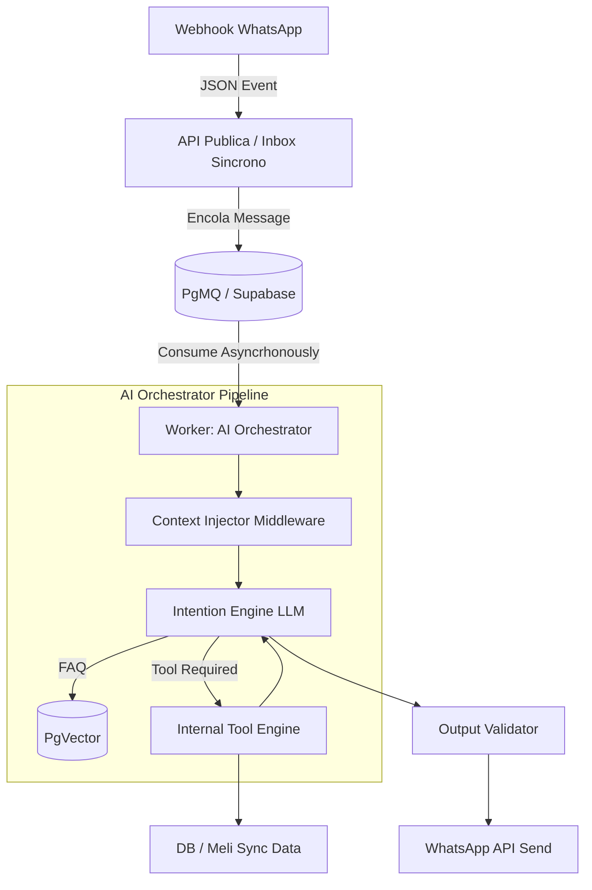

# AI Orchestrator: Architecture Blueprint

El AI Orchestrator es el cerebro autónomo pero altamente restringido de la plataforma B2B2C. Este documento define su funcionamiento profundo bajo las reglas estrictas de que "la IA no es fuente de verdad transaccional" y el "aislamiento estricto multi-tenant".

## 1. Patrón Arquitectónico: Agentive Workflow (Worker)

> **Decisión de implementación (2026-04-08)**: El diseño original preveía pgmq (Supabase Queues).
> La implementación actual usa **polling activo** sobre la columna `messages.processed` cada 3s.
> Razón: más simple para Alpha, sin dependencia de pgmq en Supabase Free. La migración a pgmq
> está prevista para Beta Controlada cuando el volumen de mensajes lo justifique.
> El plan Free de Render tampoco soporta Background Workers — se usa un Web Service con `server.py`
> que lanza el worker en un daemon thread.

El orquestador no expone APIs públicas de negocio. Corre como un **Web Service** en Render que internamente hace polling a Supabase, procesa mensajes con Gemini, y envía respuestas por WhatsApp Cloud API.

## 2. Context Ingestion y Aislamiento Multi-Tenant

El LLM **nunca** asume ni decide a qué tenant pertenece ni interactúa.
El flujo se inyecta desde la capa superior:
1. El evento traído de la cola tiene atado un `tenant_id` y `session_id`.
2. El Context Injector recupera de Postgres de forma segura (usando `Service Role` pero limitando la query al tenant) los prompts y contexto de ese negocio.
3. El LLM opera siempre "creyendo" que es el empleado de una única tienda.

## 3. Manejo de Media Multisource

Cuando el usuario envía a WhatsApp una foto o audio:
1. La API Pública descarga el asset de Meta temporalmente.
2. Sube el fichero a `Supabase Storage` bajo `bucket_id=tenant_id/{conversation}/...`.
3. Pasa la URI permanente asegurada (vía RLS firmada) como `image_url` en la cola.
4. El Orchestrator lee este asset usando soporte Multimodal (Gemini Vision) para parsearlo e incluirlo en su prompt de Tool Calling.

## 4. Handoff y Operator Escape Hatch

El orquestador detiene inmediatamente toda generación automática e invoca el webhook de Telegram para el tenant si:
- El Router detecta enfado.
- El usuario pide explícitamente "hablar con un humano".
- Un guardrail o un ratelimit ha sido vulnerado.
- Un Intent supera un "Umbral de Confianza" bajo (<70%).